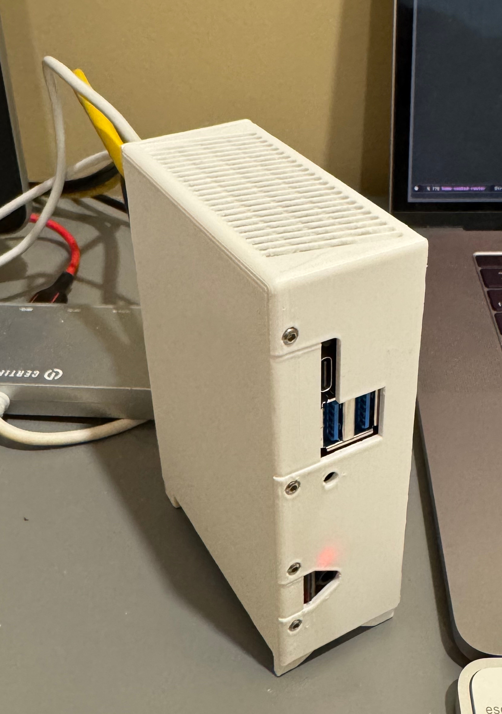

Already acquired the OrangePi 5 Plus, likely another Huawei attempt to rule the
world by embedding malicious intent directly in the firmware of the
Rockchip 3588 that I'm entrusting my home network to. But it was cheap.

(The case is [in Fusion](https://a360.co/4ajG9qd), rendered in PETG on a Bambu P1S.)

The job will be arranging that Ansible modifies their (also dubious) Debian
root image to my purposes, then moving the root FS to an SSD. 
